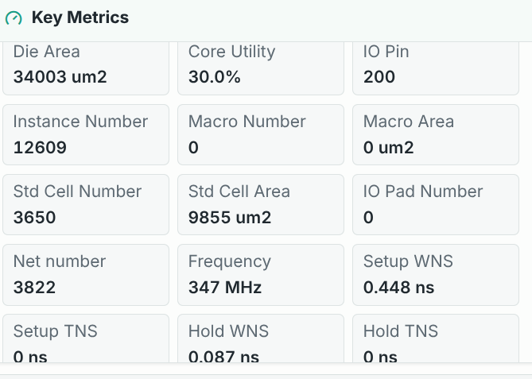
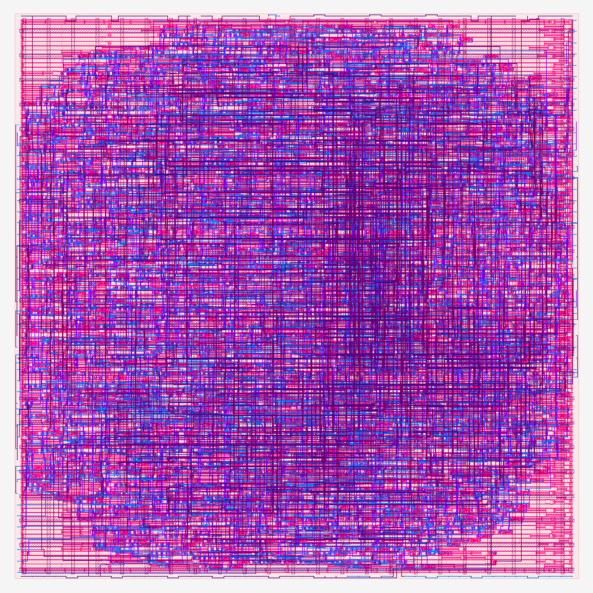

# AES-128-Core-Iterative

一个用 Verilog-2005 编写的迭代式 AES-128 加密核，面向面积优先的硬件实现。项目包含核心 RTL、32 位共享 IO 封装、仿真测试，以及综合和后端设计资料。仅支持 128 位密钥的单块加密。

## 设计一览

- **共享 S-box：** 密钥扩展和状态变换分时使用同一块 256×8 位同步 ROM。
- **迭代计算：** 仅保存当前轮密钥，按列复用 MixColumns；从接受 `start` 到 `done` 共 456 个时钟周期。
- **接口封装：** `aes128_iterative_core` 提供 128 位密钥、明文和密文接口；`Aes128Iterative` 将其接入 32 位双向数据总线。
- **验证：** 包含 ROM、MixColumns、核心及封装层测试，并用 AES 已知答案向量检查加密结果。

## 架构图


控制状态的完整跳转见 [流程图](docs/control_flow.svg)。模块说明见 [架构文档](docs/architecture.md)，信号和读写时序见 [接口文档](docs/interface.md)。

## 仿真

目录用途、结果位置和旧路径迁移见 [目录说明](docs/directory-layout.md)。

安装 Icarus Verilog 后，在仓库根目录运行：

```sh
make test
```

该命令依次运行 ROM、MixColumns、核心和封装层测试。单项测试可使用 `make test-rom`、`make test-mix`、`make test-core` 或 `make test-wrapper`。

## 后端设计预览





这张图是 ECOS Studio 后端工程快照，**尚未正确集成 S-box ROM 宏**，不能视为最终流片版图或签核结果。现有综合、面积与时序数据及其限制见 [设计报告（PDF）](artifacts/pdf/aes128_design_report.pdf)。
