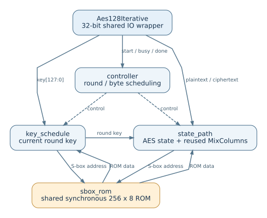
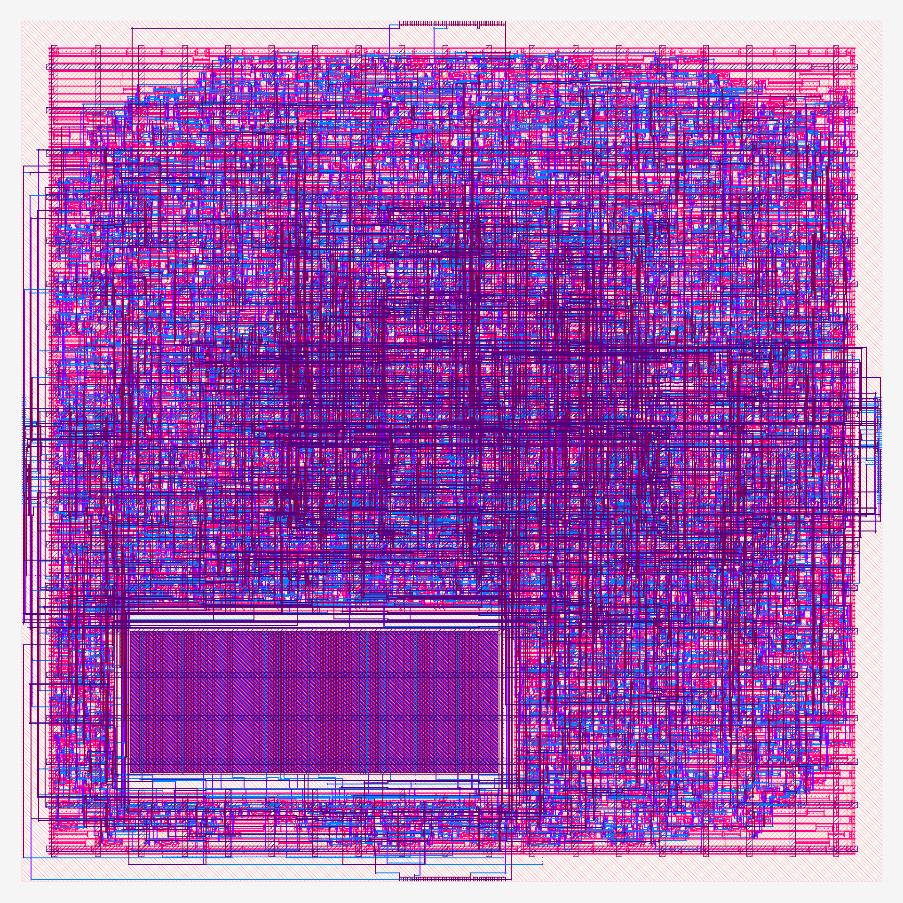

# AES-128-Core-Iterative

一个用 Verilog-2005 编写的迭代式 AES-128 加密核，面向面积优先的硬件实现。项目包含核心 RTL、32 位共享 IO 封装、仿真测试，以及综合和后端设计资料。仅支持 128 位密钥的单块加密。

## 设计一览

- **共享 S-box：** 密钥扩展和状态变换分时使用同一块 256×8 位同步 ROM。
- **迭代计算：** 仅保存当前轮密钥，按列复用 MixColumns；从接受 `start` 到 `done` 共 456 个时钟周期。
- **接口封装：** `aes128_iterative_core` 提供 128 位密钥、明文和密文接口；`Aes128Iterative` 将其接入 32 位双向数据总线。
- **验证：** 包含 ROM、MixColumns、核心及封装层测试，并用 AES 已知答案向量检查加密结果。

## 架构图



控制状态的完整跳转见 [流程图](docs/control_flow.svg)。模块说明见 [架构文档](docs/architecture.md)，信号和读写时序见 [接口文档](docs/interface.md)。

## 仿真

目录用途和结果位置见 [目录说明](docs/directory-layout.md)。

安装 Icarus Verilog 后，在仓库根目录运行：

```sh
make test
```

该命令依次运行 ROM、MixColumns、核心和封装层测试。单项测试可使用 `make test-rom`、`make test-mix`、`make test-core` 或 `make test-wrapper`。

## 最终流片版本

项目最终流片结果为 aes-mpc-ecc/ws-area20：ICS55 工艺，20 MHz，核心利用率和布局目标密度均为 50%，综合策略 AREA 0。后端流程、13 个 STA 工况、LEC、DRC 和 LVS 检查已完成，且已按此版本下单。

### 最终 RCX 后布局



### 后端结果指标

| 类别     | 指标                         |                        结果 |
| -------- | ---------------------------- | --------------------------: |
| 配置     | 目标时钟频率 / 周期          |              20 MHz / 50 ns |
| 配置     | 核心利用率设置               |                         50% |
| 配置     | 布局目标密度                 |                         50% |
| 配置     | 综合策略                     |                      AREA 0 |
| 面积     | Die 尺寸                     |            158.4 × 158.4 µm |
| 面积     | Die 面积                     |               25,090.56 µm² |
| 面积     | Core 面积                    |               22,022.56 µm² |
| 面积     | 后端报告核心利用率           |                         55% |
| 面积     | 综合标准单元面积（不含 ROM） |               10,991.85 µm² |
| 面积     | 综合标准单元数量             |                       3,754 |
| 时序     | STA 工况                     |                  13/13 通过 |
| 时序     | 最差 Setup WNS               | +3.981 ns（MAX_125/Cworst） |
| 时序     | 最差 Hold WNS                |  +0.071 ns（MIN_m40/Cbest） |
| 时序     | Setup / Hold TNS 与违例数    |          0 ns / 0 ns；0 / 0 |
| 物理验证 | DRC / LVS 违例               |                       0 / 0 |
| 逻辑验证 | 综合后 LEC / 布线后 LEC      |                 通过 / 通过 |
| 寄生参数 | RCX SPEF 覆盖 / 解析失败     |                     9/9 / 0 |
| 流程     | 后端步骤                     |                  15/15 成功 |
| 签核检查 | 通过 / 阻塞 / 提醒           |                  34 / 0 / 4 |

功耗仅有综合阶段估算：动态功耗 125.68 µW、漏电功耗 12.19 µW；该估算未作为最终功耗签核结果。ROM 阵列版图仍按订单备注由平台完成内容替换和集成。

ECOS Factory 提交文件及 ROM 内容附件位于 [最终交付目录](aes-mpc-ecc/signoff/ws-area20/)。ROM 内容替换要求见目录内的 rom-order-note.txt。配置、运行状态和签核说明见 [ECC 后端指南](docs/ecc-backend.md) 与 [最终流片版本记录](docs/ecc-area-optimization.md)。

ECC 导出的 .v 和 .def 描述用户模块 Aes128Iterative。ROM 存储阵列版图按订单备注由平台替换内容并集成。

## ECC 后端

最终流片版本的配置、检查和 `.v`/`.def` 交付步骤见 [ECC 后端指南](docs/ecc-backend.md)。
